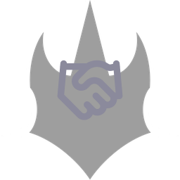
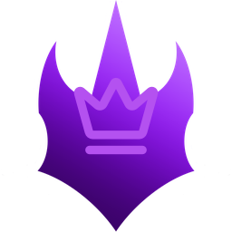
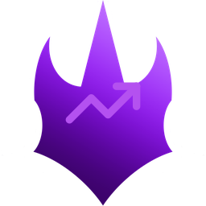
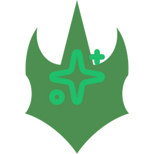

# KOBA Achievement Badges — Reference Sheet

Full catalog of every earnable badge (`features/achievements/lib/catalog.ts`).
Badges are **earned only** — never bought, sold, or gifted. Each image below
is the exact same asset the app renders: the badge's rarity crest
(`public/brand/rarity/*.png`) with its lucide icon overlay, tinted to the
tier color. Legendary and Relic badges additionally pulse with an animated
glow in-app (`animate-badge-glow`, `app/globals.css`) — not visible in a
static PNG.

Account type refers to the **active KOBAID identity** (`PLAYER` / `BUSINESS`
/ `INFLUENCER`) needed to unlock the badge — most badges are earnable by any
account type; the Marketplace badges require a `BUSINESS` identity because
only a Business identity can own a Shop.

---

## Tenure — Account Age

| Badge | Name | Description | How it's earned | Account type |
|---|---|---|---|---|
|  | **First Anniversary** | Been part of KOBA for 1 year. | Account `createdAt` is 1+ year ago. | Any |
|  | **Two-Year Veteran** | Been part of KOBA for 2 years. | Account `createdAt` is 2+ years ago. | Any |
|  | **Three-Year Veteran** | Been part of KOBA for 3 years. | Account `createdAt` is 3+ years ago. | Any |
|  | **Five-Year Legend** | Been part of KOBA for 5 years. | Account `createdAt` is 5+ years ago. | Any |
|  | **Decade Club** | Been part of KOBA for 10 years. | Account `createdAt` is 10+ years ago. | Any |

## Trading

| Badge | Name | Description | How it's earned | Account type |
|---|---|---|---|---|
|  | **First Trade** | Completed your first item trade. | 1+ `TradeOffer` reaches `COMPLETED` (as proposer or counterparty). | Any |
|  | **Trade Veteran** | Completed 10 item trades. | 10+ completed trades. | Any |
|  | **Trade Master** | Completed 50 item trades. | 50+ completed trades. | Any |
|  | **Relic Collector** | Owns a Relic-rarity item. | Own 1+ `InventoryItem` at Relic rarity (top tier, from a Relic-rarity purchase, drop, or trade). | Any |

## Marketplace (Selling)

| Badge | Name | Description | How it's earned | Account type |
|---|---|---|---|---|
|  | **Shop Owner** | Opened a shop on KOBA. | Own a `Shop`. | **Business** |
|  | **First Sale** | Made your first sale. | 1+ `Order` on your shop reaches `PAID`/`FULFILLED`. | **Business** |
|  | **Verified Seller** | Your shop passed KOBA verification. | Shop `verificationStatus` is `VERIFIED` (staff review). | **Business** |
|  | **Storefront Staple** | Sold 50 orders from your shop. | 50+ paid/fulfilled orders on your shop. | **Business** |

## Community

| Badge | Name | Description | How it's earned | Account type |
|---|---|---|---|---|
|  | **Conversation Starter** | Left your first comment on a product. | Post 1+ `ProductComment`. | Any |
|  | **Social Butterfly** | Published 25 posts. | 25+ `Post`s authored. | Any |
|  | **Community Favorite** | Followed by 50 other players. | 50+ `UserFollow` rows targeting you. | Any |

## Special

| Badge | Name | Description | How it's earned | Account type |
|---|---|---|---|---|
|  | **KOBA Plus** | Active KOBA Plus subscriber. | `PlusSubscription.state` is `ACTIVE`. | Any |
|  | **Plus Veteran** | KOBA Plus subscriber for over a year. | Currently `ACTIVE`, and `firstActivatedAt` was 1+ year ago. | Any |
|  | **Founding Member** | Joined KOBA in its very first month. | Account `createdAt` on or before **2025-09-13** (30 days after KOBA's real launch migration, `20250814120000_init`). | Any |

---

### Rarity tiers (badge color key)

| Tier | Color | Crest source |
|---|---|---|
| Common | Gray `#8b8a9c` | `public/brand/rarity/common.png` |
| Uncommon | Green `#1fbf6c` | `public/brand/rarity/uncommon.png` |
| Rare | Blue `#33c1f0` | `public/brand/rarity/rare.png` |
| Epic | Purple `#b451f0` | `public/brand/rarity/epic.png` |
| Legendary | Gold `#ffb648` (animated glow) | `public/brand/rarity/legendary.png` |
| Relic | Red `#ff2469` (animated glow) | `public/brand/rarity/relic.png` |

### Source of truth

This sheet is generated from `features/achievements/lib/catalog.ts` (badge
data) and `features/achievements/services/achievement.service.ts`
(`CRITERIA_EVALUATORS`, the real unlock logic). If those files change, this
sheet needs regenerating to stay accurate — it is a snapshot, not live data.
