# KOBA Achievement Badges — Reference Sheet

Full catalog of every earnable badge (`features/achievements/lib/catalog.ts`), 64 total.
Badges are **earned only** — never bought, sold, or gifted. Every badge is an original
circular coin medallion (`features/achievements/components/badge-frame.tsx`) with a recessed
emblem panel behind the glyph. Ladder badges (account age, trade volume, game collector,
Boost rank) emboss a bold rank numeral into that panel instead of a distinct icon per rung.

KOBA Plus tenure badges are the one exception to the coin shape: they render as a faceted
gem-cut shield (`features/achievements/components/plus-gem-badge.tsx`), traced directly
from the client's own 6 hand-drawn outline sketches (2026-08-17). Every tier shares one
shield silhouette (apex, faceted shoulders, a rounded taper to the point); what changes per
tier is the accessory built onto it, exactly as drawn: Bronze is the shield alone; Silver
gets a small arc nested inside the shield near the tip; Gold cuts the shield short and hangs
a plain teardrop gem below it; Diamond keeps the full-length shield and adds a 6-petal fan
flaring from the shoulders, plus the same plain teardrop; Emerald adds a marquise gem above
the apex, an arched double band across the shoulders, and a round gem stud at each shoulder,
and its teardrop grows a segmented chevron tail; Ruby has the identical marquise/arch/studs/
petals as Emerald but keeps a plain teardrop (no tail) — exactly what the client drew.
Platinum and Opal weren't in the client's 6 examples (6 of KOBA's 8 real Plus tiers);
extrapolated in the same language — Platinum carries Silver's arc and Gold's teardrop
together, Opal reuses Emerald's full ornament set in the original KOBA Plus rainbow
spectrum. Each tier is rendered in its own real gem material (bronze copper, silver, gold,
cool platinum, icy diamond, emerald green, ruby red). The real KOBA Plus mark
(`public/brand/koba-plus-mark.png`, client-supplied) is engraved into the center of every
tier using the same light/dark relief technique as the coin badges — built into the gem's
own tones, not a separately-colored sticker glued on top.

## Special (10)

| Badge | Name | Rarity | Description | Threshold |
|---|---|---|---|---|
| 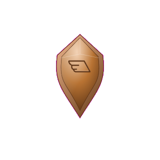 | **KOBA Plus** | Common | Active KOBA Plus subscriber. | 0 |
| 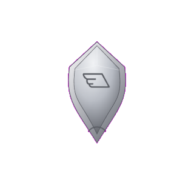 | **KOBA Plus — Silver** | Common | KOBA Plus subscriber for 3+ months. | 3 |
| 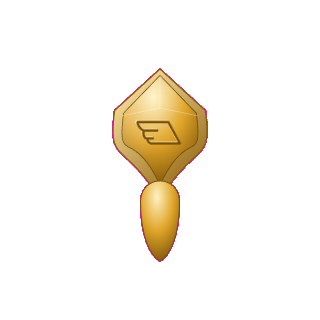 | **KOBA Plus — Gold** | Uncommon | KOBA Plus subscriber for 6+ months. | 6 |
| 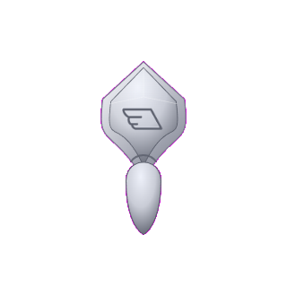 | **KOBA Plus — Platinum** | Rare | KOBA Plus subscriber for 12+ months. | 12 |
| 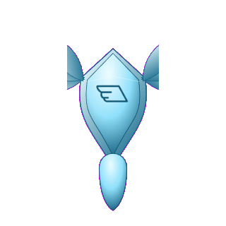 | **KOBA Plus — Diamond** | Rare | KOBA Plus subscriber for 24+ months. | 24 |
| 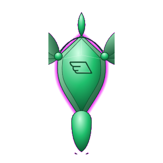 | **KOBA Plus — Emerald** | Epic | KOBA Plus subscriber for 36+ months. | 36 |
| 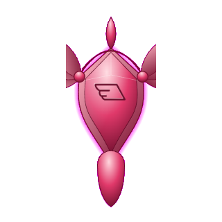 | **KOBA Plus — Ruby** | Legendary | KOBA Plus subscriber for 60+ months. | 60 |
|  | **KOBA Plus — Opal** | Relic | KOBA Plus subscriber for 72+ months. | 72 |
| 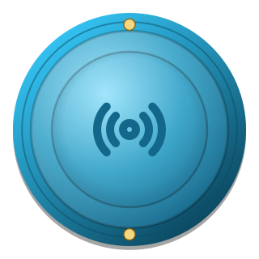 | **Influencer Partner** | Rare | Active KOBA Influencer partner. | — |
| 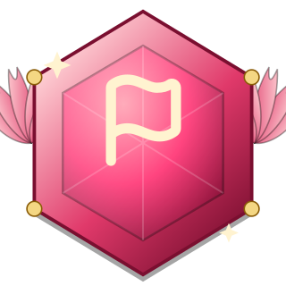 | **Founding Member** | Relic | Joined KOBA in its very first month. | — |

## Tenure (10)

| Badge | Name | Rarity | Description | Threshold |
|---|---|---|---|---|
|  | **First Anniversary** | Common | Been part of KOBA for 1 year. | 1 |
|  | **Two-Year Veteran** | Common | Been part of KOBA for 2 years. | 2 |
|  | **Three-Year Veteran** | Uncommon | Been part of KOBA for 3 years. | 3 |
|  | **Four-Year Veteran** | Uncommon | Been part of KOBA for 4 years. | 4 |
| 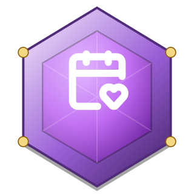 | **Five-Year Veteran** | Rare | Been part of KOBA for 5 years. | 5 |
|  | **Six-Year Veteran** | Rare | Been part of KOBA for 6 years. | 6 |
|  | **Seven-Year Veteran** | Epic | Been part of KOBA for 7 years. | 7 |
|  | **Eight-Year Veteran** | Epic | Been part of KOBA for 8 years. | 8 |
|  | **Nine-Year Veteran** | Legendary | Been part of KOBA for 9 years. | 9 |
|  | **Decade Club** | Relic | Been part of KOBA for 10 years. | 10 |

## Trading (21)

| Badge | Name | Rarity | Description | Threshold |
|---|---|---|---|---|
|  | **Casual Trader** | Common | Completed 1 item trade. | 1 |
|  | **Frequent Trader** | Common | Completed 3 item trades. | 3 |
| 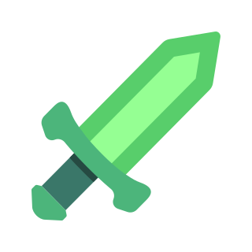 | **Dedicated Trader** | Uncommon | Completed 7 item trades. | 7 |
| 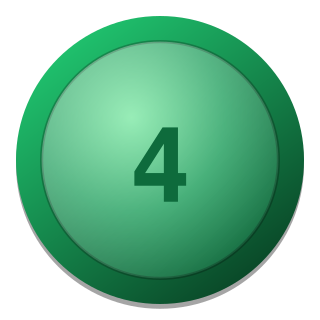 | **Committed Trader** | Uncommon | Completed 15 item trades. | 15 |
| 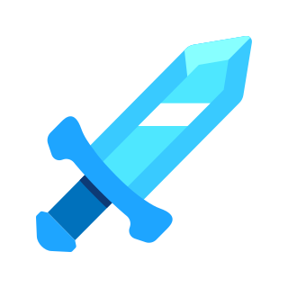 | **Serious Trader** | Rare | Completed 25 item trades. | 25 |
|  | **Devoted Trader** | Rare | Completed 40 item trades. | 40 |
| 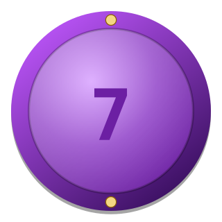 | **Seasoned Trader** | Epic | Completed 60 item trades. | 60 |
|  | **Ironclad Trader** | Epic | Completed 90 item trades. | 90 |
| 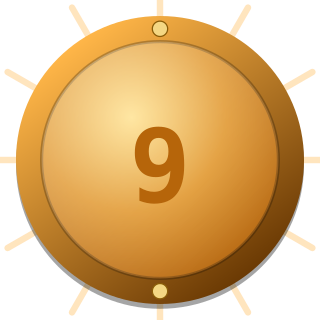 | **Unshakeable Trader** | Legendary | Completed 130 item trades. | 130 |
| 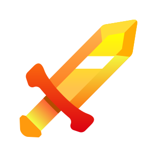 | **Eternal Trader** | Relic | Completed 200 item trades. | 200 |
| 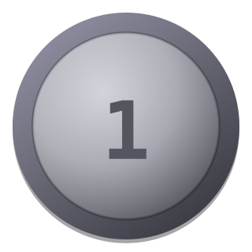 | **Sampler** | Common | Own items from 2 different games. | 2 |
| 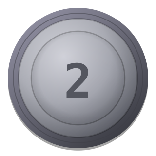 | **Dabbler** | Common | Own items from 4 different games. | 4 |
|  | **Enthusiast** | Uncommon | Own items from 6 different games. | 6 |
|  | **Ranger** | Uncommon | Own items from 9 different games. | 9 |
|  | **Explorer** | Rare | Own items from 12 different games. | 12 |
| 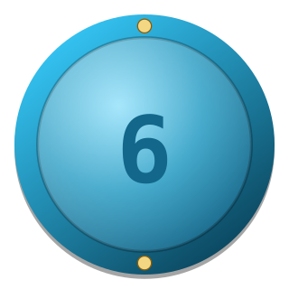 | **Adventurer** | Rare | Own items from 16 different games. | 16 |
|  | **Voyager** | Epic | Own items from 20 different games. | 20 |
| 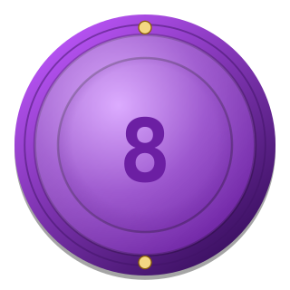 | **Maverick** | Epic | Own items from 26 different games. | 26 |
|  | **Polymath** | Legendary | Own items from 34 different games. | 34 |
|  | **Universalist** | Relic | Own items from 44 different games. | 44 |
| 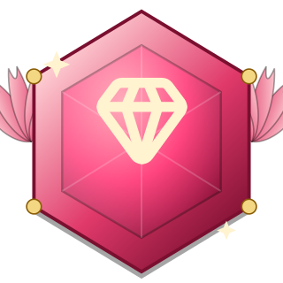 | **Relic Collector** | Relic | Owns a Relic-rarity item. | — |

## Marketplace (18)

| Badge | Name | Rarity | Description | Threshold |
|---|---|---|---|---|
|  | **Boost Rank I** | Common | Purchased 1 Boost in total. | 1 |
| 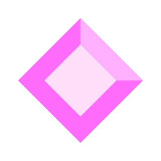 | **Boost Rank II** | Common | Purchased 2 Boosts in total. | 2 |
| 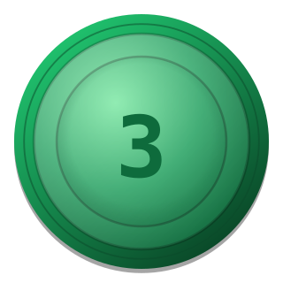 | **Boost Rank III** | Uncommon | Purchased 3 Boosts in total. | 3 |
|  | **Boost Rank IV** | Uncommon | Purchased 5 Boosts in total. | 5 |
| 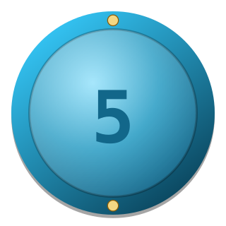 | **Boost Rank V** | Rare | Purchased 8 Boosts in total. | 8 |
|  | **Boost Rank VI** | Rare | Purchased 12 Boosts in total. | 12 |
|  | **Boost Rank VII** | Epic | Purchased 18 Boosts in total. | 18 |
| 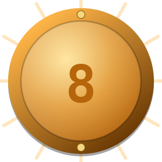 | **Boost Rank VIII** | Legendary | Purchased 25 Boosts in total. | 25 |
| 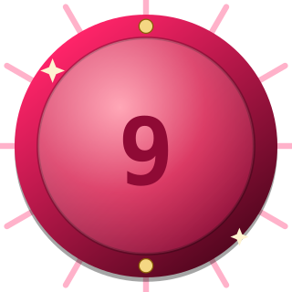 | **Boost Rank IX** | Relic | Purchased 35 Boosts in total. | 35 |
| 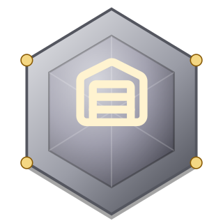 | **Shop Owner** | Common | Opened a shop on KOBA. | — |
|  | **First Sale** | Uncommon | Made your first sale. | — |
| 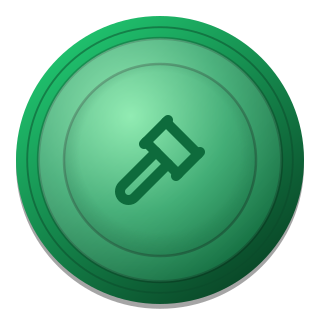 | **Highest Bidder** | Uncommon | Won an auction. | — |
| 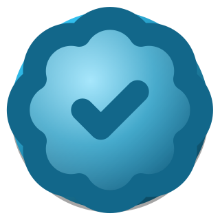 | **Verified Seller** | Rare | Your shop passed KOBA verification. | — |
| 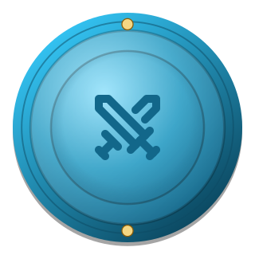 | **Auction Champion** | Rare | Won 5 auctions. | — |
|  | **Big Spender** | Epic | Spent $500 or more on the Marketplace. | — |
| 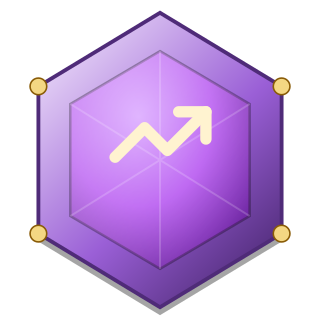 | **Storefront Staple** | Epic | Sold 100 orders from your shop. | — |
|  | **Top Seller** | Legendary | Sold 500 orders from your shop. | — |
|  | **Whale** | Legendary | Purchased 10,000 or more KOBA Coins in total. | — |

## Community (5)

| Badge | Name | Rarity | Description | Threshold |
|---|---|---|---|---|
|  | **Conversation Starter** | Common | Left your first comment on a product. | — |
| 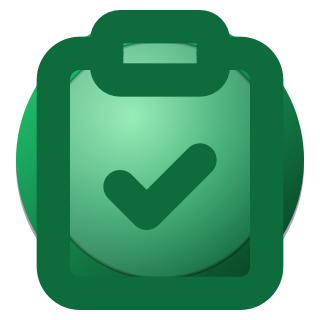 | **Critic** | Uncommon | Wrote 10 shop reviews. | — |
| 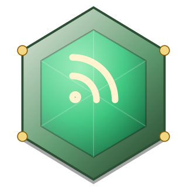 | **Social Butterfly** | Uncommon | Published 25 posts. | — |
| 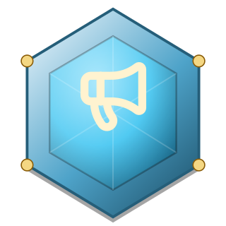 | **Prolific Poster** | Rare | Published 100 posts. | — |
|  | **Trusted Seller** | Epic | Shop holds a 4.5+ average rating across 10 or more reviews. | — |

---

### Source of truth

This sheet is generated directly from `features/achievements/lib/catalog.ts`
(`ACHIEVEMENT_CATALOG` + `LADDER_THRESHOLDS`) and rendered through the same
`BadgeFrame` component and real `koba-plus-mark.png` the app itself uses — it's a
snapshot, not live data, so regenerate it whenever the catalog changes.