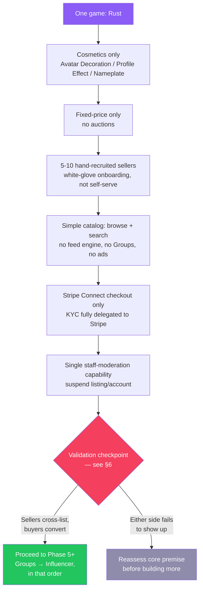

# The Unified KOBA Thesis

Synthesizes [`market-research.md`](market-research.md) and
[`product-research.md`](product-research.md) into one working thesis —
not a re-summary of either, a decision document. Written 2026-08-13,
after Phases 0-5 were already built. That timing matters and is
addressed directly in §3 and §6: engineering has moved faster than the
validation-first path both research passes recommend, so this document
also has to reckon with what's already shipped, not just what to build
next.

---

## 1. Market Reality Summary

The category is real. Tebex ($1B+ cumulative GMV, $240M paid to
creators in 2024 alone), Codefling (41K members, live real-money Rust
map/monument marketplace), BuiltByBit (the Minecraft equivalent), and
Discord's cosmetics line (~10-15% of a company earning well over $1B)
all prove real money moves through exactly this category of good, at
scale.

It is **not greenfield**. Every slice of KOBA's pitch already has a
working incumbent: Tebex owns server-monetization mindshare, Codefling
and BuiltByBit own the maps/plugins niche for Rust and Minecraft
specifically, Steam's own market owns liquid skin trading, Discord owns
the "sell pre-made cosmetic flair" model KOBA is copying. KOBA's
differentiation claim — a cross-game social feed and follow/discovery
layer sitting on top of a marketplace — has no direct precedent
succeeding in this category. Every incumbent above wins through
search/SEO/community-forum discovery, not a social feed.

Sizing (all synthesized estimates, not cited figures — see
`market-research.md` §1 for the full derivation): **TAM ~$300M-$800M/yr**
across KOBA's full 14-title PC list, **SAM ~$50M-$150M/yr** once
entrenched per-game incumbents are netted out (concentrated in Rust and
Minecraft), **realistic Year 1-3 SOM ~$1M-$5M GMV** (~$40K-$400K/yr
platform revenue at the now-decided 8%/4% fee tiers) — a real but
modest outcome unless a specific wedge breaks out.

**One legal fact changes the shape of the marketplace pillar:** Studio
Wildcard's CurseForge terms require monetized ARK:SA mods to route
through their own Tebex-wallet-only "Premium Mods" channel. KOBA
facilitating ARK asset trades outside that channel is a sourced,
specific policy conflict — not a background risk, an active blocker for
that one title. See §2.

---

## 2. Red Flags & Constraints Table

| # | Flag | Severity | Detail | Gate before proceeding |
|---|---|---|---|---|
| 1 | ARK:SA monetization conflict | **Blocker** | CurseForge's ARK:SA policy requires paid mods to go through Wildcard's own Tebex-wallet-only Premium Mods program. KOBA facilitating ARK trades outside that is a direct ToS conflict. | Legal review before ARK enters the marketplace pillar in any form beyond cosmetics; hold out entirely until resolved. |
| 2 | Unverified per-game ToS (10 of 14 titles) | High | Only Minecraft, Rust, ARK, and DayZ were checked against primary-source policy. Valheim, Conan Exiles, 7DTD, Unturned, GMod, S&Box, Project Zomboid, Eco, Terraria, Starbound were not — compliance is unproven, not assumed-safe. | Check each title's EULA/ToS individually before its marketplace (not just cosmetics) features go live. |
| 3 | Seller migration is untested | **Blocker for scale** | The entire supply side depends on sellers with existing Tebex/CurseForge storefronts choosing to cross-list or migrate to KOBA. Nothing in the current build tests this. | 5-10 hand-recruited sellers cross-listing manually, before more Phase 4+ investment (see §5). |
| 4 | Buyer trust on a new platform is untested | High | Every sourced revenue figure in the market research is revenue to an *incumbent* with existing buyer traffic; none demonstrates new-platform buyer trust. | Real paid pilot (actual Stripe checkout, minimal UI) measuring conversion, not assumed from catalog quality alone. |
| 5 | Social/feed-as-discovery is unproven | High | KOBA's core differentiation claim vs. every competitor has zero direct precedent in this category succeeding. Feed-driven discovery needs content volume KOBA won't have at launch. | Ship a plain filterable catalog first; only build the feed ranking engine (Phase 8) if real session data justifies it. |
| 6 | Console kit-only limits the differentiated pillar | Medium | Maps/monuments/custom assets (KOBA's most differentiated inventory vs. Discord/pure-cosmetics competitors) are PC-only by the README's own console policy. | Check real sell-through mix (cosmetics vs. PC-only assets) before further Map Builder (Phase 9) investment. |
| 7 | Influencer referral cannibalization | Medium | Referral programs are frequently net-negative without an organic baseline to measure lift against — structural risk, not execution risk. | Don't build Phase 10 until months of organic sales data exist per shop; test one shop manually (spreadsheet discount code) first. |
| 8 | Tebex/Codefling/BuiltByBit switching cost | Medium | Sellers already have payment infra, tax handling, chargeback insurance (Tebex), and SEO/community trust (Codefling/BuiltByBit) — KOBA's 8%/4% fee is not a decisive undercut of Codefling's flat 10%. | Discovery/social layer has to prove out (Flag 5) to be the actual differentiator, since fee alone won't win switchers. |
| 9 | Scope-to-validation ratio | High (process risk, not market risk) | 13-phase roadmap has no validation checkpoint before Phase 12-13 ("everything is built"). Roughly half the roadmap (Ads, Dev Portal, Influencer, full Social/DM, Feed engine) is unrelated to proving the core trade loop. | See §6 — insert an explicit gate now, given Phases 1-5 are already built. |
| 10 | Ads-as-monetization is premature | Low (deferred, not live risk) | Native ads need attention (DAU × session time) to sell against, which doesn't exist pre-launch. Platform take-rate (already built, Phase 3) is a simpler, already-functioning monetization model. | Defer Phase 7 indefinitely until organic traffic data justifies it. |

---

## 3. KOBA MVP Diagram

What the market/product research says the *actual* MVP looks like —
materially smaller than what's already been built (Phases 1-5). This
is a target shape for the next validation cycle, not a description of
current state.

What's already built beyond this diagram (Phases 1-5: multi-role
KOBAID, account switching, auctions, 6-tier rarity, multi-type catalog,
shop analytics/promo config, Groups+LFG) is **ahead of** this MVP
shape, not behind it — engineering completeness has outpaced
validation. That gap is the thing §6's decision gate exists to close,
not a reason to keep building further ahead of it.

---

## 4. KOBA Wedge Strategy

Narrowing sequence, combining both research passes' recommended wedge:

1. **Lead with cosmetics, 2 games not 14.** Rust and Minecraft
   specifically — largest active communities on the list, most sourced
   precedent (Discord Nitro analogue, friendliest EULA posture of every
   title checked), and the schema is already built cleanly for it
   (Phase 3's enforced pre-made-only `CosmeticType` enum).
2. **Add Rust maps/monuments as the second pillar**, explicitly
   positioned as a Codefling/BuiltByBit challenger — undercut on fee,
   differentiate on the follow-a-creator discovery layer as a genuine
   experiment, not an assumed win. This is evidenced demand (Codefling
   proves the niche works), not a blue ocean.
3. **Hold ARK out of the marketplace pillar** until Flag 1 (§2) is
   legally resolved. Cosmetics-only for ARK, if included at all, is the
   safer interim scope.
4. **Everything else is post-validation expansion**: the remaining
   10+ titles (each needing its own ToS check, not assumed-compliant by
   analogy), additional product types, and eventually the
   community/creator/ad layers — gated by §6, not built in parallel.
5. **Fee positioning**: 8% unverified / 4% Blue-Badge-verified (decided,
   see `platform-fee-research.md`) undercuts Fiverr/Roblox by a wide
   margin and sits close to Etsy's blended rate, but is not a decisive
   undercut of Codefling's flat 10% — the wedge has to win on discovery
   and trust, not on fee alone, per Flag 8.

---

## 5. KOBA Do-Not-Build List

Not "never" — "not until the validation gate in §6 clears." Ordered by
how firmly each is deferred:

- **Native ad network (Phase 7)** — separate product, separate
  buyers (advertisers), separate trust problems (ads visually identical
  to organic content). Nothing about proving the core trade loop needs
  this. Defer indefinitely until organic traffic exists to sell against.
- **Developer portal (Phase 9)** — Map Builder + six versioned APIs is
  a B2D tooling business with its own support burden (docs, SDKs,
  sandbox infra), zero dependency on whether the marketplace works.
  Spin out or defer, don't let it compete for engineering time with
  marketplace validation.
- **Influencer system (Phase 10)** — structurally impossible to
  measure incrementality without an organic sales baseline first (Flag
  7). Defer until that baseline exists.
- **Feed engine (Phase 8)** — a filterable grid is a fine substitute
  until catalog size and real session data justify ranking. Building
  this before there's content to rank solves a problem that doesn't
  exist yet.
- **Full social layer beyond a basic feed** — DMs' voice/video calls
  and Vanish Mode are a substantial standalone subsystem (a dedicated
  SFU provider, per ROADMAP's own open question) unrelated to proving
  the marketplace. Not on the validation-critical path at all.
- **Auctions, multi-game/multi-type catalog, shop analytics depth,
  promo/rarity-distribution reporting** — already built (Phases 3-4)
  ahead of the MVP shape in §3. Not "undo," but: no *further*
  investment in this direction (more auction features, more rarity
  tiers, deeper analytics) until §6 clears.
- **Groups + LFG deeper features** — the module itself is already
  built (Phase 5); the do-not-build is anything *beyond* what exists —
  invite/request-to-join flows, deeper community tooling — until
  Groups proves out as a distribution channel, not before.
- **Blue Badge program depth, full three-tier RBAC nuance** — a single
  "staff can moderate" capability is enough pre-launch; the fuller
  Superadmin/Admin/Moderator distinction and Blue Badge's manual-review
  workflow can wait for real volume worth the process overhead.

---

## 6. Validation Plan

Concrete, cheap, sequenced — each tests one Red Flag from §2 before
more engineering goes toward the assumption it rests on.

| Test | Tests which flag | Method | Signal to watch |
|---|---|---|---|
| Manual seller recruitment | #3 (seller migration) | Recruit 5-10 Business-role sellers from Rust/Minecraft server communities; have them cross-list 3-5 items via spreadsheet + a manual Stripe payment link — zero marketplace UI required. | Will they do this for free with nothing built? If not, self-serve Business-mode won't change their mind either. |
| Real-money pilot | #4 (buyer trust) | Same manual listings, but real checkout, pointed at a small paid-traffic or community-post sample. | Actual conversion rate vs. adjacent marketplaces' known benchmarks (Codefling/BuiltByBit order volume as a rough comparator). |
| Catalog vs. feed test | #5 (social discovery) | Ship a plain sortable/filterable grid first (already buildable from Phase 3-4's existing Product model — no new engineering). Instrument search vs. browse behavior once there's real catalog volume. | Only build Phase 8's feed ranking engine if data justifies it — not before. |
| Sell-through mix check | #6 (console/PC split) | Once live, track revenue split: cosmetics (all-platform) vs. maps/monuments/assets (PC-only). | Determines how much further Map Builder (Phase 9) investment is justified. |
| ARK legal review | #1 (blocker) | Direct legal/compliance review of Wildcard's Premium Mods policy against KOBA facilitating ARK trades outside it. | Go/no-go specifically for ARK entering the marketplace pillar — cosmetics-only fallback if unresolved. |
| Per-title ToS sweep | #2 | Individual EULA/ToS check for each of the 10 unverified titles before that title's marketplace (not cosmetics-only) features ship. | Pass/fail per title — don't assume compliance by analogy to the four already checked. |
| Manual referral test | #7 (influencer cannibalization) | Once organic sales data exists for a shop, run one manual discount-code referral (spreadsheet-tracked) and compare lift against that shop's own trend line. | Only automate Phase 10 if lift is real and measurable. |

---

## 7. Post-MVP Decision Gates

What has to be true to move past the §3 MVP shape into each deferred
area — and what would instead signal a reassessment of the core
premise.

**Gate to Phase 6+ generally (Social layer beyond a basic feed, deeper
Groups):**
- ✅ Proceed if: hand-recruited sellers cross-list without heavy
  hand-holding (validates #3), **and** real buyers convert at a rate
  comparable to adjacent marketplaces (validates #4).
- ❌ Reassess if: sellers won't cross-list even with zero engineering
  cost asked of them, or buyers don't convert even with real inventory
  and working checkout — that's a signal the marketplace premise itself
  needs rethinking, not that more features (social/ads/community) will
  compensate.

**Gate to Groups as a real distribution channel (beyond what Phase 5
already built):**
- ✅ Proceed if: a manually-simulated version (KOBA staff posting in an
  existing Discord) shows real referral traffic before building further
  Groups tooling.
- ❌ Hold if: no measurable traffic lift from community-channel
  distribution in the manual test.

**Gate to Phase 8 (Feed engine):**
- ✅ Proceed if: the §6 catalog-vs-feed test shows real session data
  where a feed would plausibly outperform search/browse (needs catalog
  volume to even be testable).
- ❌ Hold if: catalog stays small enough that a filterable grid remains
  sufficient — revisit only when volume changes the picture.

**Gate to Phase 10 (Influencer):**
- ✅ Proceed if: months of organic sales data exist per shop, **and**
  a manual single-shop referral test shows real incremental lift, not
  cannibalized organic sales.
- ❌ Hold indefinitely if: no organic baseline exists yet, or the
  manual test shows referred sales just relabel sales that would have
  happened anyway.

**Gate to Phase 7 (Ads) and Phase 9 (Dev Portal):**
- ✅ Ads: proceed only once organic DAU × session-time data shows
  enough attention to be worth selling against — treat as a
  launch-readiness threshold, not a scheduled phase.
- ✅ Dev Portal: proceed only as a deliberately separate initiative
  with its own resourcing decision, not as competition for engineering
  time against marketplace validation. Consider spinning out as its own
  roadmap rather than a numbered KOBA phase.
- ❌ Neither should move forward on roadmap-position momentum alone —
  both need their own gate, independent of how many other phases have
  shipped.

**Gate to expanding past Rust + Minecraft (the remaining 12 titles):**
- ✅ Proceed per-title once that title's individual ToS sweep (§6)
  clears **and** the Rust/Minecraft wedge shows real GMV — expand one
  validated title at a time, not the full list at once.
- ❌ Hold ARK specifically until Flag 1 resolves, regardless of how the
  rest of the wedge performs.

---

*Companion documents: [`market-research.md`](market-research.md),
[`product-research.md`](product-research.md),
[`platform-fee-research.md`](platform-fee-research.md).*
